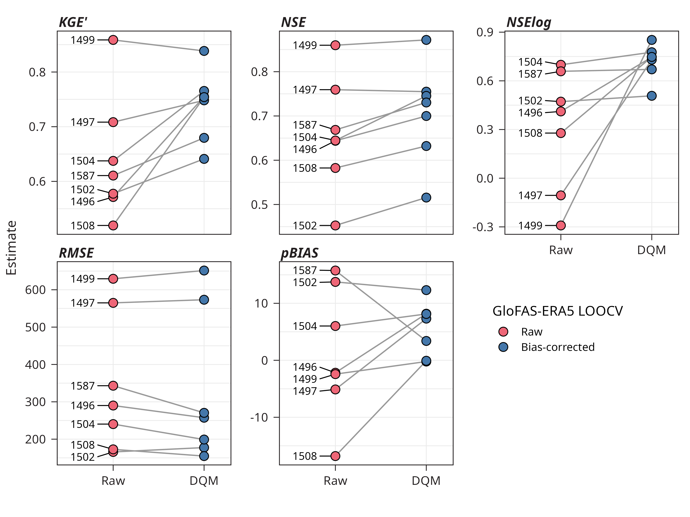

# Reconstructing daily streamflow data for Anadyr River using GloFAS-ERA5 reanalysis

<p align="center">
     <a href="https://github.com/atsyplenkov/glofas-anadyr/.github/workflows/ci.yml"></a>
</p>

Repository contains code and data to reproduce the results of the paper "Reconstructing daily streamflow data for Anadyr River using GloFAS-ERA5 reanalysis" submitted to the journal "GEOGRAPHY, ENVIRONMENT, SUSTAINABILITY". To cite this work, please use the following citation:

> Tsyplenkov A., Shkolnyi D., Kravchenko A., Golovlev P. Reconstructing daily streamflow data for Anadyr River using GloFAS-ERA5 reanalysis. GEOGRAPHY, ENVIRONMENT, SUSTAINABILITY. (In Review) 

### Abstract
The Anadyr River is the largest river system in the Russian Far East with no water discharge observations available since 1996. The current study addresses this data scarcity by reconstructing daily streamflow series for the period 1979–2025 using the GloFAS-ERA5 v4.0 reanalysis product. To mitigate systematic model biases, we applied the Detrended Quantile Mapping correction method, optimised via a Leave-One-Out Cross-Validation strategy using historical gauging records and recent in-situ ADCP water discharge measurements.

The bias-correction procedure yielded a meaningful improvement in predictive performance, increasing the median Modified Kling-Gupta Efficiency by approximately 17% across the basin. Notably, the cross-validation analysis revealed that for stations previously used in initial global model calibration, a parsimonious linear scaling approach (with one quantile only) outperformed complex non-linear mapping, thereby preventing overfitting. The reconstructed long-term time series reveals a robust, statistically significant increasing trend in mean annual water discharge across the basin (up to 0.5% per year). These findings align the Anadyr River with the broader pattern of hydrological intensification observed across the Eurasian Arctic, likely driven by a shift in precipitation regimes from snow to rain during the shoulder seasons. This research demonstrates that bias-corrected global reanalysis offers a reliable alternative to ground-based monitoring in data-scarce Arctic environments.

<figure>
  
  <figcaption>
    Estimated changes in median cross-validation metrics across all gauging stations between raw and bias-corrected GloFAS-ERA5 daily streamflow data for the Anadyr River basin.
  </figcaption>
</figure>

### Project structure
The `Snakefile` is the backbone of the workflow. It defines the order of the steps and the dependencies between them.

```text
.
├── container.def   # Singularity definition file
├── container.sif   # Singularity image file
├── data            # Data directory with 
│   ├── cv          # LOOCV results
│   ├── geometry    # Gauging station locations
│   ├── glofas      # GloFAS-ERA5 grids
│   ├── hydro       # Pre-processed streamflow data
│   └── raw         # Raw streamflow data
├── figures         # Figures for the paper
├── tables          # Tables for the paper
├── renv            # renv internal dir
│   ├── activate.R
│   ├── library
│   ├── settings.json
│   └── staging
├── renv.lock       # renv file with R deps
├── pyproject.toml  # Python project desc
├── uv.lock         # uv file with Python deps
├── scripts         # Scripts directory, both R and Py
└── Snakefile       # Snakemake workflow file

```

### How to use reproduce
1. Clone the repository:
```shell
git clone https://github.com/atsyplenkov/glofas-anadyr
cd glofas-anadyr
```

2. Install `miniforge3` and `apptainer` using default params as described in their docs. Then install `snakemake`. Any `snakemake` version will do, but the current template has been tested under `9.14.1`:
```shell
conda create -c conda-forge -c bioconda -n snakemake snakemake=9.14.1
```

3. Activate `snakemake` by running:
```shell
conda activate snakemake
```

4. Run the workflow with the following command:
```shell
snakemake --use-singularity --cores 1
```
