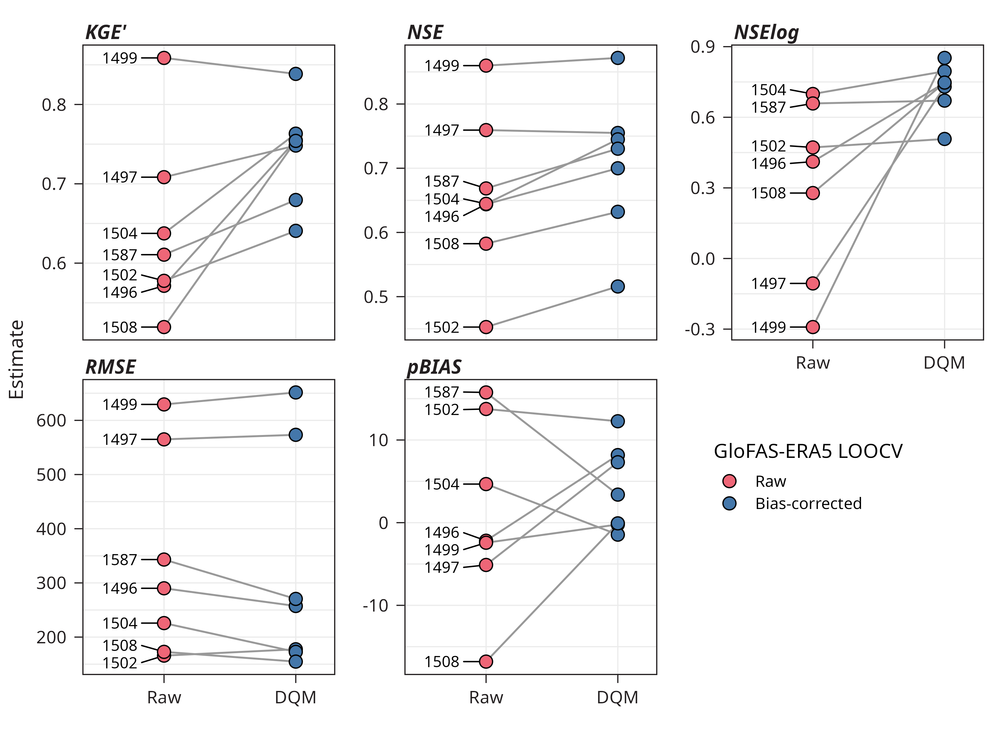

# Reconstructing daily streamflow data for Anadyr River using GloFAS-ERA5 reanalysis

<p align="center">
     <a href="https://atsyplenkov.github.io/glofas-anadyr/"></a>
     <a href="https://github.com/atsyplenkov/glofas-anadyr/.github/workflows/cd.yml"></a>
     <a href="https://github.com/astral-sh/ruff"></a>
</p>

Repository contains code and data to reproduce the results of the paper "Reconstructing daily streamflow data for Anadyr River using GloFAS-ERA5 reanalysis" submitted to the journal "GEOGRAPHY, ENVIRONMENT, SUSTAINABILITY". To cite this work, please use the following citation:

> *Tsyplenkov A., Shkolnyi D., Kravchenko A., Golovlev P.* Reconstructing daily streamflow data for Anadyr River using GloFAS-ERA5 reanalysis. GEOGRAPHY, ENVIRONMENT, SUSTAINABILITY. 2026 (*In Review*)

You can explore and download the corrected streamflow series at https://atsyplenkov.github.io/glofas-anadyr/

### Abstract
The Anadyr River is the largest river system in the Russian Far East with no water discharge observations available since 1996. The current study addresses this data scarcity by reconstructing daily streamflow series for the period 1979–2025 using the GloFAS-ERA5 v4.0 reanalysis product. To mitigate systematic model biases, we applied the Detrended Quantile Mapping correction method, optimised via a Leave-One-Out Cross-Validation strategy using historical gauging records and recent in-situ ADCP water discharge measurements.

The bias-correction procedure yielded a meaningful improvement in predictive performance, increasing the median Modified Kling-Gupta Efficiency by approximately 17% across the basin. Notably, the cross-validation analysis revealed that for stations previously used in initial global model calibration, a parsimonious linear scaling approach (with one quantile only) outperformed complex non-linear mapping, thereby preventing overfitting. The reconstructed long-term time series reveals a robust, statistically significant increasing trend in mean annual water discharge across the basin (up to 0.5% per year). These findings align the Anadyr River with the broader pattern of hydrological intensification observed across the Eurasian Arctic, likely driven by a shift in precipitation regimes from snow to rain during the shoulder seasons. This research demonstrates that bias-corrected global reanalysis offers a reliable alternative to ground-based monitoring in data-scarce Arctic environments.

<p align="center">
  
</p>

> Estimated changes in median cross-validation metrics across all gauging stations between raw and bias-corrected GloFAS-ERA5 daily streamflow data for the Anadyr River basin. Each point represents the median of 10–17 LOOCV metric estimates for a single station.

### Project structure
The `Snakefile` is the backbone of the workflow. It defines the order of the steps and the dependencies between them. The snakemake workflow is designed to be run in a containerized environment using Apptainer. Host-side workflow orchestration is managed with `pixi`, while container dependencies are managed with `renv` and `uv`.

```text
.
├── container.def   # Singularity definition file
├── container.sif   # Singularity image file
├── data/           # Data directory with 
│   ├── cv          #  LOOCV results
│   ├── geometry    #  Gauging station locations
│   ├── glofas      #  GloFAS-ERA5 grids
│   ├── hydro       #  Pre-processed streamflow data
│   ├── models      #  Fitted DQM models (pickle files)
│   └── raw         #  Raw streamflow data
├── scripts/        # Scripts directory, both R and Python
├── figures/        # Figures for the paper
├── tables/         # Tables for the paper
├── renv/           # renv internal dir
├── renv.lock       # renv file with R deps
├── pyproject.toml  # Python project desc
├── pixi.toml       # Pixi workspace manifest for host launcher environment
├── pixi.lock       # Pixi lockfile
├── uv.lock         # uv file with Python deps
├── web/            # directory with scripts for CD workflow
└── Snakefile       # Snakemake workflow file

```

### How to use reproduce
1. Clone the repository:
```shell
git clone https://github.com/atsyplenkov/glofas-anadyr
cd glofas-anadyr
```

2. Obtain ECMWF API token and create `.env` file:
   * Register for a free account at Copernicus CDS. After registration, go to your user profile page and copy your API key. Read more — https://ewds.climate.copernicus.eu/how-to-api
   * Create a `.env` file in the project root directory with the following content:
```shell
echo "ECMWF_TOKEN=your_api_key" > .env
```
   Replace `your_api_key` with your actual Copernicus CDS credentials.

3. Install `pixi` and `apptainer` using default params as described in their docs.
```shell
curl -fsSL https://pixi.sh/install.sh | sh
pixi --version
```

4. Install the locked Pixi environment:
```shell
pixi install --locked
```

5. Run the workflow with the following command:
```shell
pixi run snakemake --software-deployment-method apptainer --apptainer-args "--env-file .env" --cores 1
```

### Build paper outside Snakemake (Quarto + Pixi)
If you already have up-to-date workflow outputs in `tables/` and `figures/`, you can rebuild only the manuscript without running Snakemake or rebuilding Apptainer:

1. Ensure Pixi environment is installed:
```shell
pixi install --locked
```

2. Render manuscript to `paper/paper.md`:
```shell
pixi run quarto render paper/paper.qmd --to markdown --output paper.md --execute
```

Or use the shortcut task:
```shell
pixi run paper
```

> [!IMPORTANT]
> `paper/paper.qmd` reads values directly from `tables/tbl2_cv-results.csv` and `tables/tbl3_trends-results.csv`. If these files are stale, regenerate them first (e.g., with the workflow command above).

> [!NOTE]
> There is no need to use the orchestration, it is anticipated that each step can be run manually. Just follow the order of the steps in `Snakefile` and the dependencies between them. However, some filepaths should be updated.
