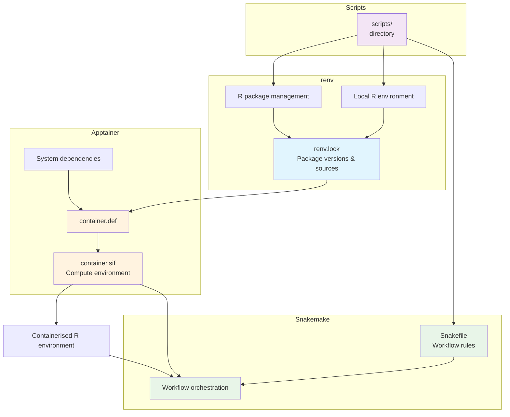

# Snakemake R Workflow with Apptainer and renv

<p align="center">
     <a href="https://github.com/atsyplenkov/snakemake_apptainer_renv/.github/workflows/ci.yml"></a>
     <a href="https://opensource.org/licenses/MIT"></a>
     <a href="https://github.com/atsyplenkov/snakemake_apptainer_renv/generate">
         
     </a>
</p>

### 🟪 summary
This project shows how to use Snakemake to automate an R workflow inside a reproducible Singularity/Apptainer container. It builds a container image from a definition file `container.def`, installing R packages listed in the `renv.lock` and all system dependencies. Then `snakemake` runs your scripts inside the created container (`container.sif`) in order defined in the `Snakefile`. Such approach makes sure that the computational environment is reproducible and reusable. As an extra bonus, it comes with the continuous integration that runs the workflow on every push to the `master` branch.



### 🟩 project structure
The `Snakefile` is the backbone of the workflow. It defines the order of the steps and the dependencies between them. In the current implementation it uses the built-in [R integration of Snakemake](https://snakemake.readthedocs.io/en/stable/snakefiles/rules.html#r-and-r-markdown). That is, user can specify variables in the `Snakefile` and use them in the R scripts via `snakemake@input` and `snakemake@output` objects (see `scripts/test_script.R` for an example).

```text
.
├── container.def   # Singularity definition file
├── container.sif   # Singularity image file
├── in              # Input directory
│   └── mtcars.csv
├── out             # Output directory
│   ├── cyl.csv
│   └── paths.txt
├── renv            # renv directory
│   ├── activate.R
│   ├── library
│   ├── settings.json
│   └── staging
├── renv.lock       # renv lock file
├── scripts         # Scripts directory
│   └── test_script.R
└── Snakefile       # Snakemake workflow file

```
### 🔷 how to use reproduce
1. Clone the repository or create new from [a template](https://github.com/atsyplenkov/snakemake_apptainer_renv/generate):
```shell
git clone https://github.com/atsyplenkov/snakemake_apptainer_renv.git
cd snakemake_apptainer_renv
```

2. Install `miniforge3` and `apptainer` using default params as described in their docs. Then install `snakemake`. Any `snakemake` version will do, but the current template has been tested under `9.10.0`:
```shell
conda create -c conda-forge -c bioconda -n snakemake snakemake=9.10.0
```

3. Activate `snakemake` by running:
```shell
conda activate snakemake
```

4. Run the workflow with the following command:
```shell
snakemake --use-singularity --cores 1
```
If you want to run workflow in parallel, you can use the following command:
```shell
snakemake --use-singularity --cores 2
```
It will make `snakemake` to run jobs `run_test_script` and `run_test_script2` simultaneously.

### 🟧 see also
- [A bit more complex implementation](https://github.com/bast/contain-R) of similar approach connecting `renv` and `snakemake` with Singularity by [**@bast**](https://github.com/bast)
- [Testing Snakemake template](https://ginolhac.github.io/posts/2023-09-07_snakemake-test-ci/index.html)
- [Pat Schloss's project](https://github.com/riffomonas/drought_index/tree/main) on running R workflows with `snakemake` (within `conda`)
- [Snakemake documentation](https://snakemake.readthedocs.io/en/stable/)
- [Singularity documentation](https://apptainer.org/docs/)
